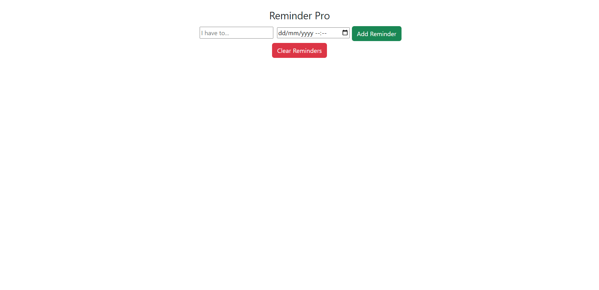

# ReactJs ToDo App functionalities
* Stores local data on cookies so you can view your reminders even if you refreash your screen.
* Has a clear all reminders button to clear all reminders.
* DateField to select your due-day.
* User can delete any reminder that they have set bu clicking the x icon on the reminder.
# Reminder Pro App
